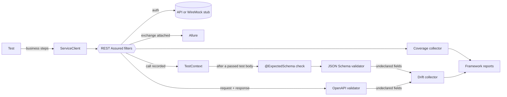

# contract-taf

[](https://github.com/Alexxfromgit/TAF-Contract-Tests/actions/workflows/ci.yml)
[](https://alexxfromgit.github.io/TAF-Contract-Tests/)
[](LICENSE)


A Java framework for API contract testing, set up as a GitHub template repository. It covers JSON Schema contracts,
OpenAPI validation, drift detection, API coverage and GraphQL, with results reported in Allure.

Stack: Java 21, TestNG, REST Assured 5, networknt json-schema-validator, Atlassian OpenAPI validator, WireMock 3 and
Allure 2.

```java
@Test(groups = Groups.SMOKE)
@ExpectedSchema(value = "schemas/petstore/pet.json", endpoint = "GET /pet/{petId}")
public void getPetById() {
    Pet pet = Pet.random("rex");
    pets.addPet(pet).then().statusCode(200);

    pets.getPet(pet.id()).then().statusCode(200);
}
```

The test contains only business steps. After it passes, the framework validates the recorded response against the
schema. It also validates every exchange against the OpenAPI document, reports fields the contract does not declare,
and counts the endpoint as covered.

## Features

| | |
|---|---|
| **Consumer-driven JSON Schema contracts** | `@ExpectedSchema` or the fluent `ContractAssert`. Drafts 04/06/07/2019-09/2020-12 are detected from `$schema`. Readable errors such as `$.tags[0].name -> required`. |
| **Tolerant by default, strict on demand** | Required fields and types are enforced and extra fields are allowed. `strict = true` rejects undeclared fields without editing the schema. |
| **OpenAPI validation** | Every request and response of a service is checked against its OpenAPI document. Message levels are configurable. |
| **Drift detection** | Fields the API returns but the contract does not declare are collected into a non-failing *API drift* report. |
| **API coverage** | Documented endpoints vs. endpoints exercised, per service. Calls to undocumented endpoints are listed too. An optional `fail-under` gate is available. |
| **Record mode** | `-Dcontract.record=missing` generates schemas from live responses for review. |
| **GraphQL** | `.graphql` documents, variables, `assertNoErrors()`, and the same schema checks on `data` via `jsonPointer`. |
| **Pluggable auth** | `none`, `bearer`, `api-key`, `basic`, `oauth2` client credentials (token cached and refreshed), or your own `AuthProvider`. Credentials are masked in reports. |
| **Offline by default** | An embedded WireMock serves the bundled stubs, so CI is deterministic. `-Denv=live` runs the same tests against real APIs. |
| **Failure taxonomy** | Allure categories separate *contract violations* and *product defects* from *test data*, *environment* and *framework* problems. |
| **Suite hygiene** | Infra-only retries (assertions are never retried), `@KnownIssue`, `@Quarantined(until=...)`, soft/hard `Verify`, and a metadata linter that fails on missing `@Owner`/`@Feature` or secrets in config. |

## Quick start

Requirements: JDK 21+ (Maven is provided by the wrapper).

```bash
./mvnw verify
```

This runs the framework's unit tests, then the example contract tests against the bundled stubs. No network is
needed and it takes about a minute. To open the report:

```bash
./mvnw -pl examples allure:serve
```

Other ways to run:

| Command | What it does |
|---|---|
| `./mvnw verify -Denv=live` | Same tests against the public Swagger Petstore and Countries GraphQL APIs |
| `./mvnw verify -Dsuite=suites/smoke.xml` | Only tests in the `smoke` group |
| `./mvnw verify -Dcontract.record=missing` | Generate schemas that do not exist yet from live responses |
| `./mvnw verify -Dcontract.coverage.fail-under=80` | Fail the build when API coverage is below 80% |
| `./mvnw verify -Dverify.mode=soft` | Collect all `Verify` failures of a test instead of stopping at the first |

> The live public Petstore does not fully conform to its own OpenAPI document. For example, it returns bodies for
> responses documented without one. The live run shows how such violations are reported, which is why the
> [live workflow](.github/workflows/live.yml) is a monitor, not a gate.

## What you get in the report

- **Behaviours**: tests grouped by `@Epic` / `@Feature`. Every HTTP exchange is attached, with `Authorization`,
  cookies and API keys masked.
- **Categories**: *Contract violations*, *Product defects*, *Known issues*, *Test data problems*,
  *Environment / infrastructure*, *Framework problems*.
- **Framework reports** suite: *API coverage* and *API drift* as HTML and JSON attachments. The same files are
  written to `examples/target/taf-reports/`.

## How it works



See [docs/architecture.md](docs/architecture.md) for the lifecycle and threading model.

## Project layout

```
taf-core/   framework code + its unit tests (knows nothing about your API)
examples/   example clients, schemas, stubs and tests (replace with your own)
docs/       guides
```

## Documentation

- [Adapting the template to your API](docs/adapting-to-your-api.md): start here
- [Contract testing guide](docs/contract-testing.md): schemas, strict mode, OpenAPI, drift, coverage, record mode
- [GraphQL](docs/graphql.md)
- [Configuration reference](docs/configuration.md)
- [Reports, failure taxonomy and suite hygiene](docs/reports.md)
- [Architecture](docs/architecture.md)

## Companion projects

- [TAF-Mobile-JAVA](https://github.com/Alexxfromgit/TAF-Mobile-JAVA) is a template for mobile UI test automation
  with Appium. It uses the same foundation as this project (config, failure taxonomy, Allure categories, linter)
  and adds cross-platform screen objects, smart sessions, network mocking and screen performance timings.
- [TAF-Appium-JAVA](https://github.com/Alexxfromgit/TAF-Appium-JAVA) is a test automation framework for Android
  and iOS native apps and mobile web, built on Java 21, Appium, TestNG and Allure.

## Contributing

Issues and pull requests are welcome. See [CONTRIBUTING.md](CONTRIBUTING.md).

## License

[MIT](LICENSE). The bundled Swagger Petstore OpenAPI document is licensed under Apache 2.0, see [NOTICE](NOTICE).
