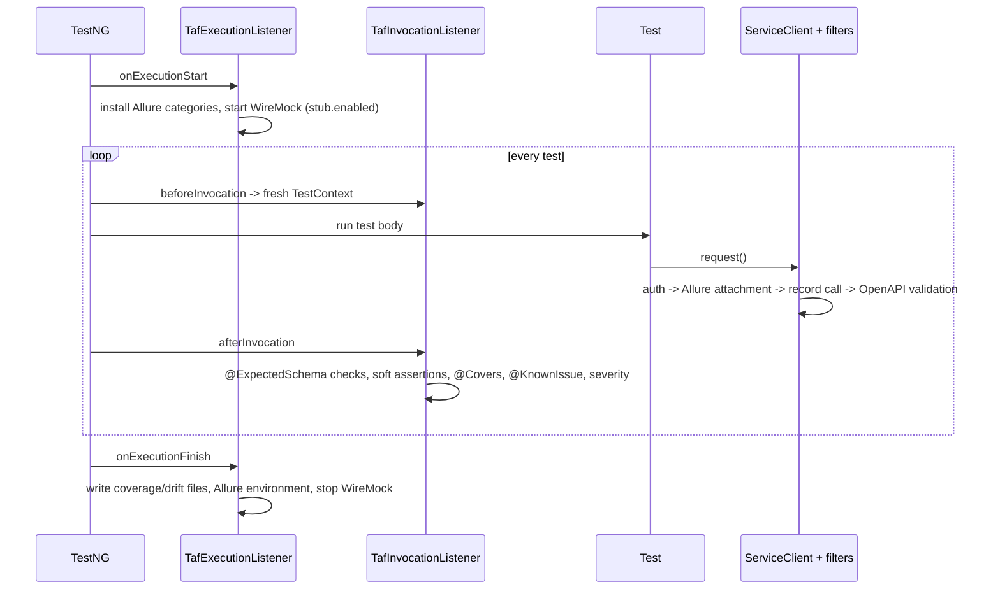

# Architecture

## Modules

| Module | Contains | Depends on |
|---|---|---|
| `taf-core` | Framework: config, HTTP, contracts, reports, TestNG integration. No knowledge of any API under test. | TestNG, REST Assured, Allure, networknt, Atlassian validator, WireMock, ClassGraph, AssertJ |
| `examples` | Clients, models, schemas, stubs, suites and tests for the demo APIs | `taf-core` |

Your own tests replace `examples`. The framework can evolve independently in `taf-core`.

## Packages of `taf-core`

```
config/        TafConfig (layered config), RuntimeOverrides, SecretsGuard
failure/       failure taxonomy (ContractViolation, PotentialDefect, TestData, Environment, Framework, KnownIssue)
http/          ServiceClient, CallRecord, CallRecorderFilter
http/auth/     AuthProvider SPI + none/bearer/api-key/basic/oauth2 + AuthProviders factory
contract/schema/    @ExpectedSchema, ContractAssert, SchemaValidator, StrictSchemaTransformer, SchemaRepository
contract/openapi/   OpenApiSpecs, OpenApiValidationFilter
contract/drift/     DriftCollector
contract/coverage/  PathTemplate, EndpointCatalog(s), CoverageCollector, CoverageReport, @Covers
contract/record/    RecordMode, SchemaInferrer, SchemaRecorder
contract/           ContractReports (suite-level report tests)
graphql/       GraphQlClient, GraphQlResponse
stub/          EmbeddedWireMock
testng/        listeners, TestContext, @KnownIssue, @Quarantined, Groups, InfraRetryAnalyzer
verify/, log/  Verify, Log
allure/, report/  Allure helpers, HTML/JSON report writers
lint/          MetadataLinter
```

## Lifecycle

Listeners are registered once, through `META-INF/services/org.testng.ITestNGListener`. Users never add them to
suites.



`TafAnnotationTransformer` runs before all of this. It disables active `@Quarantined` tests and attaches
`InfraRetryAnalyzer`.

## Threading model

- **No shared mutable request state.** Every `ServiceClient.request()` builds a new `RequestSpecification`.
  REST Assured's static configuration is never modified.
- **Per-invocation state** (recorded calls, soft assertions) lives in `TestContext`, a `ThreadLocal` reset before
  each invocation.
- **Suite-wide collectors** (`CoverageCollector`, `DriftCollector`) use concurrent collections.
- **Caches** (config snapshot, compiled schemas, OpenAPI documents, auth providers) are immutable or concurrent.
  OAuth2 tokens refresh under a lock.

The example suite runs classes in parallel (`parallel="classes" thread-count="4"`). `parallel="methods"` is
supported as well.

## Extension points

| Need | Extension |
|---|---|
| Custom authentication (cookies, signed requests, SSO) | Implement `AuthProvider`, `auth.type=custom` + `auth.class` |
| Different report categories | `src/test/resources/allure/categories.json` |
| Different lint rules | Disable rules via `lint.*` keys or write your own check next to `MetadataLintTest` |
| Message levels of OpenAPI validation | `contract.openapi.level.<key>` |
| More schema checks in one test | Repeat `@ExpectedSchema`, or call `ContractAssert` directly |
